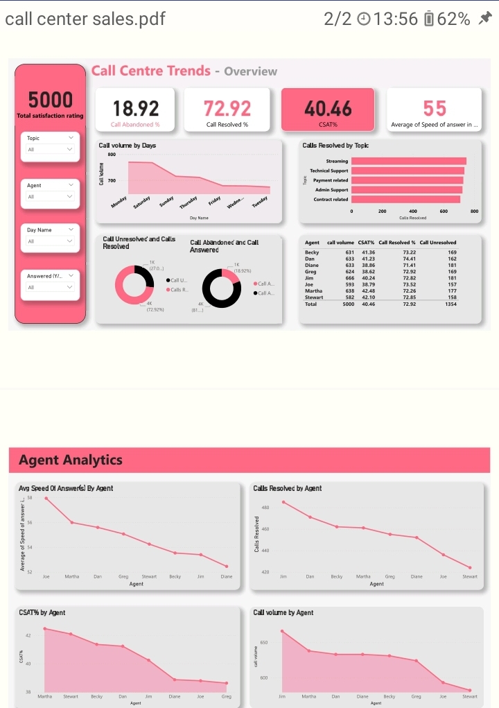

# Project Title

## Table of Contents
- [Project Overview](#project-overview)
- [Data Sources](#data-sources)
- [Tools](#tools)
- [Data Preparation/Cleaning](#data-preparationcleaning)
- [Data Visualization](#data-visualization)
- [Data Analysis](#data-analysis)
- [Results/Findings](#resultsfindings)
- [Recommendations](#recommendations)

## Project Overview
In this project Create a dashboard in Power BI for the call center manager that reflects all relevant Key Performance Indicators (KPIs) and metrics in the dataset.

Possible KPIs include (but not limited to):

- Overall customer satisfaction
- Overall calls answered/abandoned
- Calls by time
- Average speed of answer
- Agent’s performance quadrant -> average handle time (talk duration) vs calls answered
  
## Data Sources
Dataset used for this task was presented by Pwc and call centre trends dataset:

Dataset: 01 Call Centre Trends invluded in the files

## Tools
- Power BI- For data visualization and transformation 

## Data Preparation/Cleaning
- Removed Unnecessary rows and columns 
- Removing duplicates
- Data transformation

## Data Visualization 
Data Visualization was created in power bi , it shows the call centre trends

## Data Analysis
The below measures were created for the analysis:

● Average of seed of answerd = 
AVERAGE('call centre trends'[Speed of answer in seconds])

● Average of statisfaction = AVERAGE('call centre trends'[Satisfaction rating])

● Count satisfation rating = COUNT('call centre trends'[Satisfaction rating])

● Overall Customer Satisfation = DIVIDE([Possitive satisfation rating],[Count satisfation rating],0)

● Possitive satisfation rating = CALCULATE(COUNT('call centre trends'[Satisfaction rating]),FILTER('call centre trends','call centre trends'[Satisfaction rating] IN {4,5}))

● resolved calls = COUNTX(FILTER('call centre trends','call centre trends'[Resolved] = "Yes"), 'call centre trends'[Resolved])

● Unresolved calls = COUNTX(FILTER('call centre trends','call centre trends'[Resolved] = "No"), 'call centre trends'[Resolved])

● total calls = CALCULATE('Table'[total calls answered] + 'Table'[total calls unanswred])

● total calls answered = COUNTX(FILTER('call centre trends','call centre trends'[Answered (Y/N)] = "Yes"),'call centre trends'[Answered (Y/N)])

● total calls unanswred =COUNTX(FILTER('call centre trends','call centre trends'[Answered (Y/N)] = "No"), 'call centre trends'[Answered (Y/N)])

## Results/Findings

- The overall customer satisfaction score (CSAT) is at a low 40.46%, suggesting there are significant service quality issues that need to be addressed.

- 18.92% of calls are abandoned, potentially due to long wait times or under-staffing, which could be driving customer dissatisfaction.

- Only 72.92% of calls are resolved, leaving a notable portion unresolved, which may affect customer loyalty.

- Call volumes are highest on weekdays and decrease significantly over the weekend, suggesting a potential opportunity for staffing optimization.

- The agent analytics show that top-performing agents like Martha consistently outperform their peers across key metrics, indicating best practices that could be shared across the team.

## Recommendations

- Improve service quality to raise customer satisfaction, such as by reducing wait times and increasing call resolution rates.

- Review staffing levels and schedules to ensure appropriate coverage during high-volume times, which may reduce the call abandonment rate.

- Share best practices from top-performing agents with the rest of the team to improve overall performance.

- Consider implementing additional training or support systems to help agents resolve a higher percentage of calls on the first attempt.

